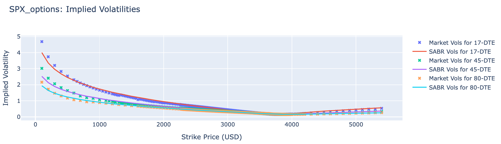
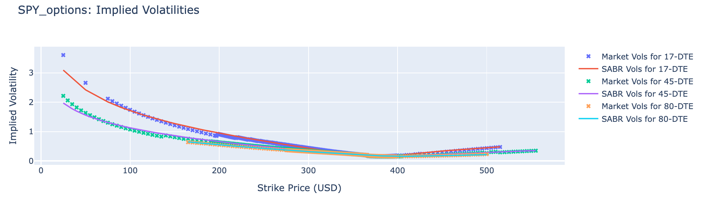
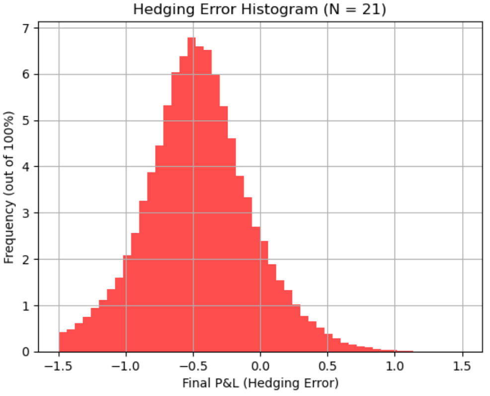
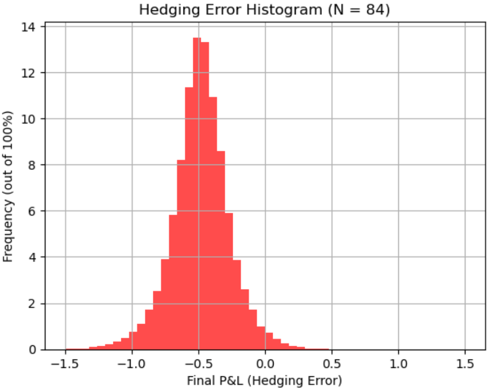
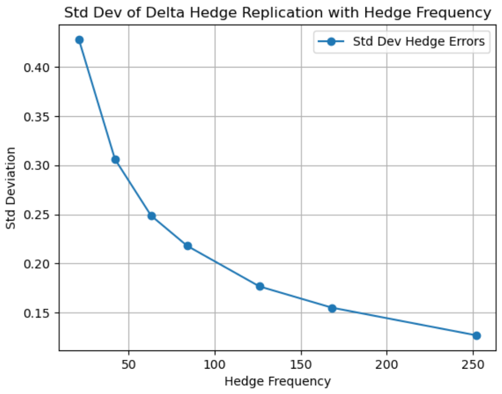

# 📈 Options Pricing, Calibration & Hedging

### **Quantitative Finance | Stochastic Modelling | Risk Management**  

This repository contains implementations of **option pricing models**, **volatility modeling**, and **dynamic hedging strategies** using Python. The project applies **theoretical pricing models** to **real-world market data** (SPX options) and evaluates **hedging errors using Monte Carlo simulations**.  

---

## 🚀 **Project Overview**
This project explores **stochastic models for option pricing and risk management**. The goal is to:
- **Price European options** using analytical formulas.
- **Calibrate models** to market-implied volatility.
- **Perform static replication** for exotic derivatives.
- **Evaluate dynamic hedging strategies** using Monte Carlo simulations.

**💡 Why This Matters:**  
These models are fundamental in **derivatives pricing, quantitative trading, and risk management**, making them essential for hedge funds, prop trading desks, and financial institutions.

---

## 📊 **Models Implemented**
### **1️⃣ Option Pricing Models**
Implemented four key pricing models for **Vanilla and Digital options**:
- **Black-Scholes Model** 🟢 (Lognormal Assumption)
- **Bachelier Model** 🔵 (Normal Assumption)
- **Black Model** 🔴 (Lognormal Forwards)
- **Displaced-Diffusion Model** 🟠 (Adjustable Skew)

Each model is used to derive **closed-form solutions** for:
✅ **Vanilla Call & Put**  
✅ **Cash-or-Nothing Digital Options**  
✅ **Asset-or-Nothing Digital Options**  

### **2️⃣ Model Calibration**
- **Calibrated Displaced-Diffusion & SABR Models** using SPX options data.
- Optimized parameters **(σ, β, α, ρ, ν)** using least-squares error minimization.
- Plotted **implied volatility smiles** and compared against market data.

### **3️⃣ Static Replication of Exotic Options**
- Replicated an **exotic European option** with payoff:
  \[
  S_T^{1/3} + 1.5 \times \log(S_T) + 10
  \]
- Used **Carr-Madan formula** for static replication.
- Compared prices under **Black-Scholes, Bachelier, and SABR models**.

### **4️⃣ Dynamic Hedging Simulations**
- Simulated hedging of an **at-the-money (ATM) European call** using **Black-Scholes delta-hedging**.
- **Monte Carlo simulations (50,000 paths)** to analyze hedging errors.
- Compared **daily hedging (N=21) vs. high-frequency hedging (N=84)**.
- Plotted **P&L distributions** of hedging errors.

---

## 📂 **Dataset Used**
- **SPX Options Data** (`SPX_options.csv`) – Market bid/ask prices of SPX options across maturities.
- **SPY Options Data** (`SPY_options.csv`) – ETF options data for comparative analysis.
- **Risk-Free Rates** (`zero_rates_20201201.csv`) – Treasury yields used for discounting.
- **Historical Spot Prices** – Used for backtesting dynamic hedging strategies.

---

## 📈 **Results & Key Insights**
### **Implied Volatility Smile (SABR Calibration)**



### **Hedging Error Distribution (Monte Carlo Simulation)**




🔹 **Increasing hedge frequency reduces errors but at diminishing returns.**  
🔹 **SABR model fits market-implied volatilities better than Displaced-Diffusion.**  
🔹 **Option prices vary significantly between lognormal (BS) and normal (Bachelier) models.**  

---

## 🛠️ **Installation & Setup**
1. Clone the repository:
   ```bash
   git clone https://github.com/yourusername/Options-Pricing-and-Calibration.git
   cd Options-Pricing-and-Calibration
